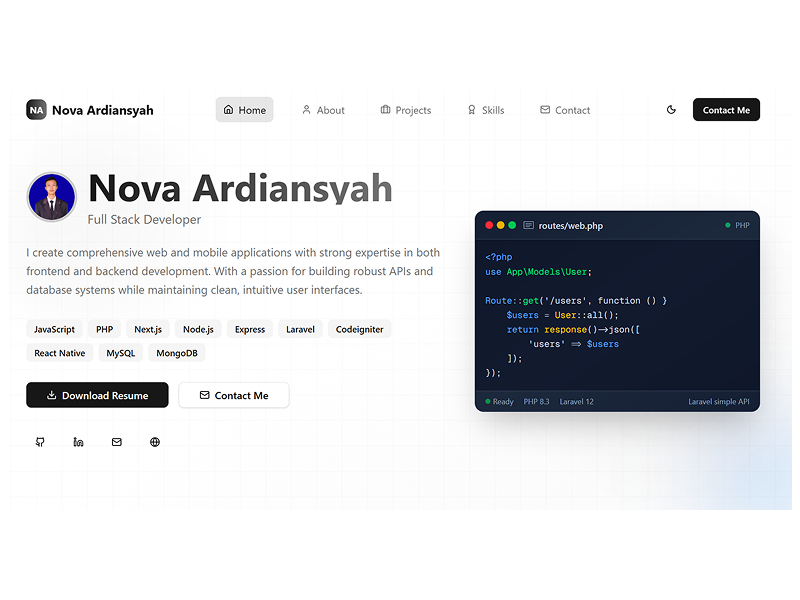

# Nova Ardiansyah Portfolio

Hi Future Developer,

Welcome to my **Next.js Portfolio**! This project is a modern, high-performance personal portfolio built with the latest **Next.js 15** and **React 19**, designed to showcase my journey, projects, and skills as a Full Stack Developer.

This repository serves as a professional presence on the web, featuring smooth animations, a responsive design system, and a dedicated file-sharing experience.

## Dazzling Tech Stack

- [Next.js 15](https://nextjs.org/) - React Framework for the Web
- [React 19](https://react.dev/) - UI Library
- [Tailwind CSS 4](https://tailwindcss.com/) - Utility-first CSS Framework
- [Framer Motion 12](https://www.framer.com/motion/) - Animation Library
- [TypeScript](https://www.typescriptlang.org/) - Type Safety
- [Radix UI](https://www.radix-ui.com/) - Primitives for accessible UI

## Performance & Optimization

This project is built with performance in mind:
- **Server Components**: Leveraging Next.js App Router for faster initial loads.
- **Optimized Assets**: Image optimization and font subsetting.
- **Smooth Navigation**: Client-side routing with smooth-scroll integration.

## Live Version 
You can explore the live portfolio at: [https://novaardiansyah.id](https://novaardiansyah.id)

## Credentials & Environment 

While this repository is public, please note that all forms of credentials, API keys (including `.env`), and environment configurations are **not provided for the public**. Access to the production database and sensitive configuration remains restricted for security reasons.

If you are interested in using this project for specific purposes or require a demo environment, please contact me directly for **exclusive permission**.

## Let's Connect!

Need to chat? Feel free to drop me a line via [Email](mailto:novaardiansyah.dev@gmail.com) or hit me up on [LinkedIn](https://www.linkedin.com/in/novaardiansyah/). I'm always open to discussing new projects, creative ideas, or opportunities to be part of your visions. 

## Project Status 

## Licensing Groove 

Exciting news! This project is grooving to the rhythm of the [MIT License](LICENSE).

Feel free to use, modify, and share it with the world. Just remember to keep the original license intact. Let's spread the joy of coding together!

---

**Happy coding and collaborating!**
— Nova Ardiansyah